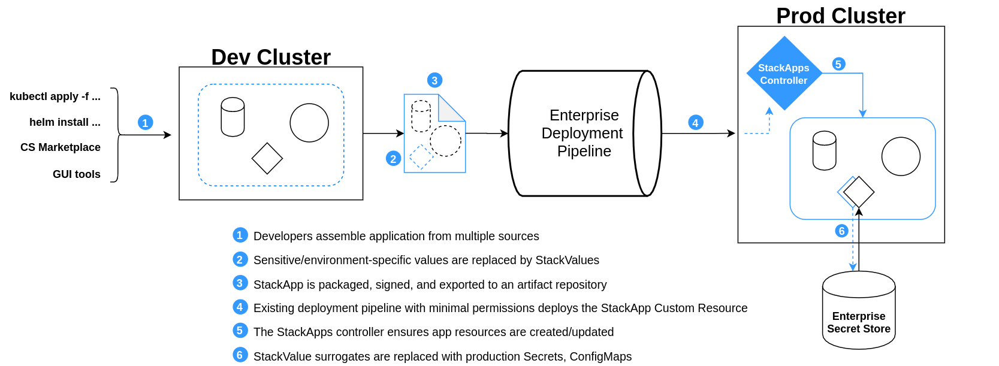

# Due to changes in the priorities, this project is currently not being supported. The project is archived as of 11/17/21 and will be available in a read-only state. Please note, since archival, the project is not maintained or reviewed. #

# stackapps

The premier, officially supported mechanism for deploying a kubernetes application into a Critical Stack cluster.



This repo is the home of `StackApps` (and `StackValues`, `StackReleases`, ...) CRDs, controllers, and webhooks.

Check out [the docs](https://criticalstack.github.io/stackapps/).

Uses [kubebuilder](https://github.com/kubernetes-sigs/kubebuilder).

## Install

Using [Helm](https://helm.sh/docs/intro/install/):

```shell
$ helm dependency update .
$ helm install stackapps ./chart
```

## Contributing

Any contributors must accept and [sign the CLA](https://cla-assistant.io/criticalstack/stackapps).

This project has adopted the [Capital One Open Source Code of conduct](https://developer.capitalone.com/resources/code-of-conduct).
